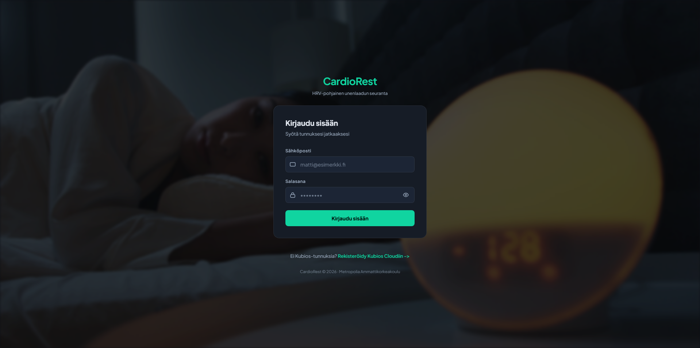
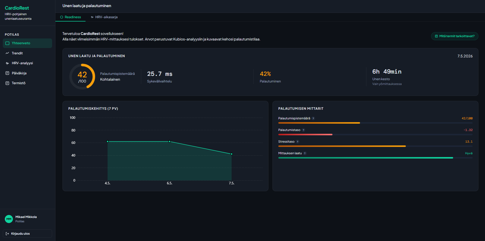
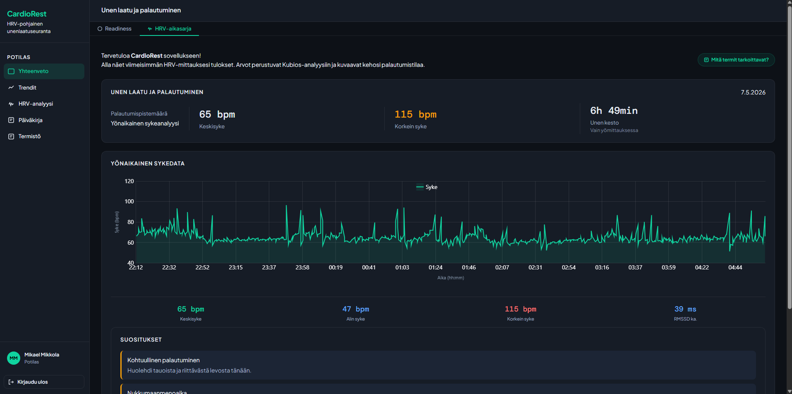
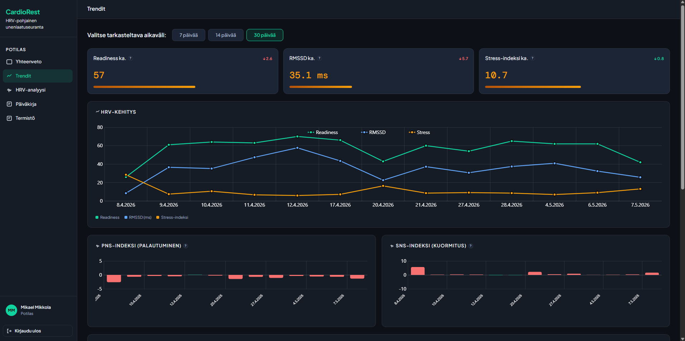
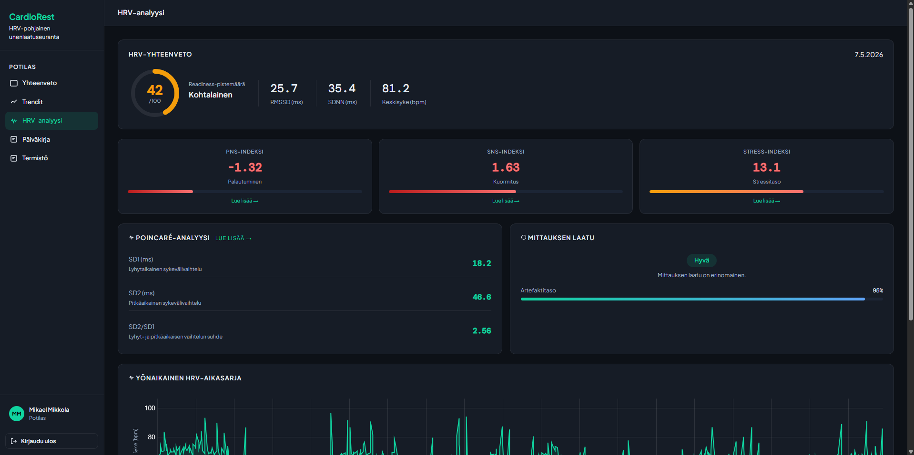
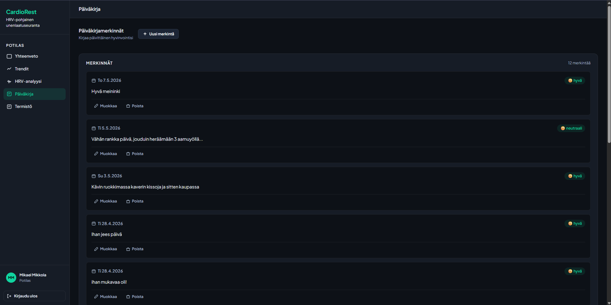
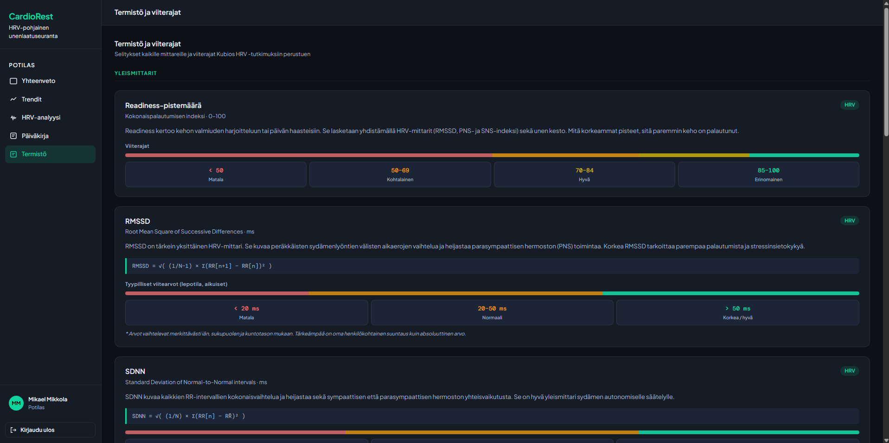

# CardioRest — Frontend

HRV-pohjainen unenlaadun seurantasovellus.  
Metropolia Ammattikorkeakoulu | Ohjelmistotestaus | Projektiryhmä 1

---

## Projektin kuvaus

CardioRest on web-sovellus joka hyödyntää Polar H10 ja Polar Sense -sykesensoreilla kerättävää HRV-dataa (sykevälivaihtelu) unen laadun ja palautumisen seurantaan. Sovellus integroi Kubios Cloud -analytiikkapalvelun readiness- ja time-varying-analyyseihin.

## Kuvakaappaukset

### Kirjautuminen



### Dashboard — Readiness



### HRV-aikasarja



### Trendit



### HRV-analyysi



### Päiväkirja



### Termistö



## Rautalankamallit

Sovelluksen suunnitteluvaiheessa luodut rautalankamallit löytyvät kansiosta `public/img/wireframes/`:

| Versio   | Linkki                                                          |
| -------- | --------------------------------------------------------------- |
| Versio 1 | [wireframe-v1.html](./public/img/wireframes/Cardio_Rest_1.html) |
| Versio 2 | [wireframe-v2.html](./public/img/wireframes/Cardio_Rest_2.html) |
| Versio 3 | [wireframe-v3.html](./public/img/wireframes/Cardio_Rest_3.html) |
| Versio 4 | [wireframe-v4.html](./public/img/wireframes/Cardio_Rest_4.html) |

**Live-demo:** [cardiorest.swedencentral.cloudapp.azure.com](https://cardiorest.swedencentral.cloudapp.azure.com)

---

## Teknologiat

| Teknologia      | Versio | Käyttötarkoitus              |
| --------------- | ------ | ---------------------------- |
| Vite            | 8.x    | Kehitysympäristö ja bundlaus |
| HTML + CSS + JS | —      | Frontend                     |
| amCharts 5      | 5.x    | Kaaviot ja visualisoinnit    |
| Axios           | 1.x    | HTTP-pyynnöt                 |

---

## Asennus

### Vaatimukset

- Node.js 20+
- npm

### Kloonaus ja asennus

```bash
git clone https://github.com/mikaemik98/cardiorest-fe.git
cd cardiorest-fe
npm install
```

### Ympäristömuuttujat

Luo `.env` tiedosto projektin juureen:

```bash
VITE_API_URL=http://localhost:3000
TEST_USERNAME=kubios@tunnuksesi.fi
TEST_PASSWORD=kubios_salasanasi
```

### Kehityspalvelin

```bash
npm run dev
```

Avaa selaimessa: `http://localhost:5173`

### Tuotantobuild

```bash
npm run build
```

---

## Sivut

| Sivu          | URL               | Kuvaus                               |
| ------------- | ----------------- | ------------------------------------ |
| Kirjautuminen | `/`               | Kubios-tunnuksilla kirjautuminen     |
| Dashboard     | `/dashboard.html` | Etusivu — readiness + HRV-aikasarja  |
| Trendit       | `/trends.html`    | 7/14/30 päivän HRV-kehitys           |
| HRV-analyysi  | `/hrv.html`       | HRV-parametrit yksityiskohtaisesti   |
| Päiväkirja    | `/diary.html`     | Päivittäinen hyvinvointipäiväkirja   |
| Termistö      | `/termisto.html`  | HRV-termien selitykset ja viitearvot |

---

## Kansiorakenne

```
cardiorest-fe/
├── index.html
├── dashboard.html
├── trends.html
├── hrv.html
├── diary.html
├── termisto.html
├── docs/                          — GitHub Pages testiraportit
│   ├── index.html
│   ├── report_iteraatio1.html
│   ├── report_iteraatio2.html
│   └── report_iteraatio3.html
├── css/
│   ├── base.css                   — muuttujat, reset, typografia
│   ├── layout.css                 — sidebar, topbar, grid
│   ├── components.css             — uudelleenkäytettävät komponentit
│   └── pages/                     — sivukohtaiset tyylit
├── js/
│   ├── api/
│   │   └── client.js              — axios-instanssi (auth-header)
│   ├── components/
│   │   ├── sidebar.js             — sivupalkki + hamburger
│   │   ├── hrvChart.js            — HRV-kaavio
│   │   └── sleepChart.js          — univaiheiden kaavio
│   ├── data/
│   │   └── mockData.js            — mock-testausdata
│   ├── pages/                     — sivukohtainen logiikka
│   ├── services/
│   │   ├── analysisService.js     — Kubios API-kutsut
│   │   └── diaryService.js        — päiväkirja API-kutsut
│   └── utils/
│       └── helpers.js             — apufunktiot
├── robot-tests/                   — automaatiotestit
│   ├── tests/
│   │   ├── auth_tests.robot
│   │   └── api_tests.robot
│   ├── resources/
│   │   ├── common.resource
│   │   ├── auth.resource
│   │   └── api.resource
│   └── outputs/                   — testiraportit (ei log tiedostoja)
└── vite.config.js
```

---

## Mock-data

Frontend toimii myös itsenäisesti ilman backendiä mock-datan avulla testausta varten.

Vaihda `js/services/analysisService.js`:ssä:

```js
export const USE_MOCK = true; // mock-data
export const USE_MOCK = false; // oikea backend
```

---

## Backend

Frontend kommunikoi backendin kanssa REST API:n kautta.  
Backend-repositorio: [cardiorest-be](https://github.com/mikaemik98/cardiorest-be)

Varmista että backend pyörii portissa `3000` ennen kuin vaihdat `USE_MOCK = false`.

API-dokumentaatio löytyy backendistä: [cardiorest-be](https://github.com/mikaemik98/cardiorest-be/blob/feature/diary/api-dokumentaatio.html)

---

## Testaus

Katso testausdokumentaatio: **[testaukset.md](./testaukset.md)**

Testiraportit GitHub Pagesilla: **[mikaemik98.github.io/cardiorest-fe](https://mikaemik98.github.io/cardiorest-fe)**

### Testien ajaminen

```bash
# Asenna riippuvuudet
pip install robotframework robotframework-requests

# Lataa ympäristömuuttujat (PowerShell)
Get-Content .env | ForEach-Object {
    if ($_ -match '^([^#][^=]*)=(.*)$') {
        [System.Environment]::SetEnvironmentVariable($matches[1].Trim(), $matches[2].Trim(), 'Process')
    }
}

# Aja testit
robot --pythonpath . --outputdir robot-tests/outputs robot-tests/tests
```

### Testitulokset

| Iteraatio                         | Testejä | Tulos    | Päivämäärä |
| --------------------------------- | ------- | -------- | ---------- |
| Iteraatio 1 — Kirjautuminen + API | 7       | ✅ 7/7   | 13.4.2026  |
| Iteraatio 2 — Päiväkirja          | 10      | ✅ 10/10 | 26.4.2026  |
| Iteraatio 3 — Regressiotestaus    | 10      | ✅ 10/10 | 5.5.2026   |

---

## Referenssit

- [amCharts 5](https://www.amcharts.com/) — kaaviokirjasto
- [Kubios Cloud API](https://analysis.kubioscloud.com/) — HRV-analytiikka
- [Robot Framework](https://robotframework.org/) — automaatiotestaus
- [Vite](https://vitejs.dev/) — frontend build tool
- [Express.js](https://expressjs.com/) — backend framework

## Ryhmä

| Nimi            | Vastuu                              |
| --------------- | ----------------------------------- |
| Markus Kauremaa | Backend + Tietokanta                |
| Mikael Mikkola  | Frontend + Kubios-integraatio ja UI |
| Moumen Flih     | Frontend + HRV                      |
| Daniil Pavliuk  | Backend + Termistö-sivu             |
